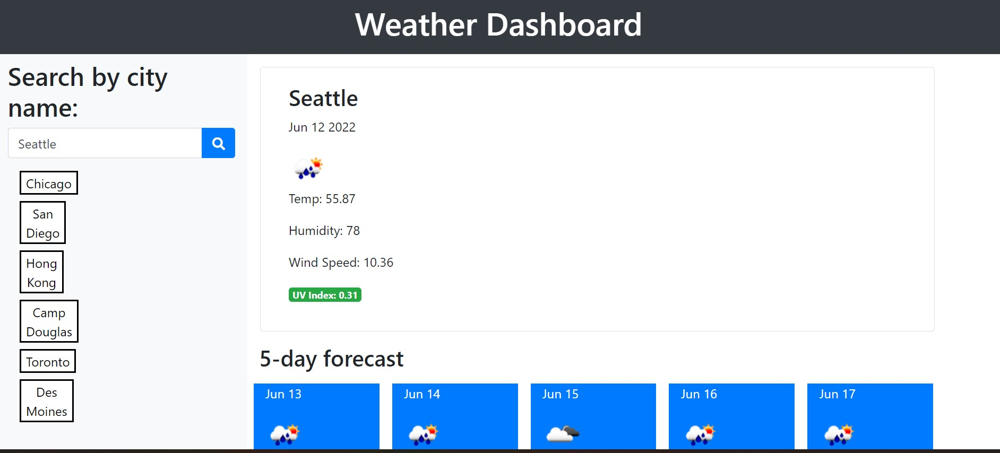

# Weather Dashboard

## Purpose

The weather dashboard is an application where the user can search for a city and be shown the current and upcoming weather conditions for that city. They can also see their past searches and click on them to display the weather for that city again. 

## Built with

-  HTML
-  Bootstrap
-  Javascript

## APIs
https://openweathermap.org/api
https://momentjs.com/

## Website
https://angiebunk1.github.io/weather-dashboard/

## Current Functionality

At the moment this application can search and display current and upcoming weather conditions for city names entered in the search box.  It can also store and persist city names searched in the past.  However, when clicking on the city names in the search history, only that last city searched can generate results (regardless of which button is clicked).  Given more time, this is a bug I would strive to repair. 

## Credits

In building this application, I consulted the work of kaylab78, sylviaprabudy, and jfisher396 on github. 

## Contribution

Created by Angela Gustafson (angiebunk1)